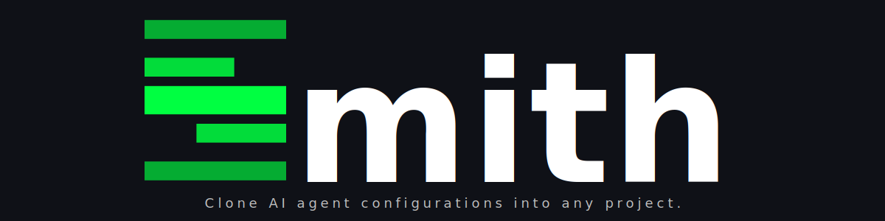

<div align="center">



<br/><br/>

[![Contributors][contributors-shield]][contributors-url]
[![Forks][forks-shield]][forks-url]
[![Stargazers][stars-shield]][stars-url]
[![Issues][issues-shield]][issues-url]
[![MIT License][license-shield]][license-url]
[](https://nullhack.github.io/agents-smith/coverage/)
[](https://github.com/nullhack/agents-smith/actions/workflows/ci.yml)
[](https://www.python.org/downloads/)

**AI-assisted software delivery system with flow-based agent orchestration.**

</div>

---

A delivery system that treats documentation as a first-class artifact and enforces production rigor through an AI-assisted workflow. Your team ships features, not broken promises.

Developers get TDD by default with traceability from requirement to test. Product Owners get living documentation that never drifts from code. Architects get adversarial review that catches what automated checks miss.

---

## Quick start

```bash
git clone https://github.com/nullhack/agents-smith
cd agents-smith
curl -LsSf https://astral.sh/uv/install.sh | sh  # skip if uv is already installed
uv sync --all-extras
opencode && @setup-project                        # personalise for your project
uv run task test && uv run task lint && uv run task static-check
```

---

## Commands

### Development

```bash
uv run task test          # full suite + coverage
uv run task test-fast     # fast, no coverage (use during TDD loop)
uv run task lint          # ruff format + check
uv run task static-check  # pyright type checking
uv run task run           # run the app
uv run task doc-build     # build API docs + coverage report
```

### Smith CLI

`smith` connects your project to the agents-smith agentic workflow files. It manages the agentic file lifecycle — connect, update, and disconnect — so your project stays in sync without manual file copying.

```bash
smith connect              # write agentic files from the default template source
smith connect --from PATH  # write agentic files from a local path
smith connect --from URL   # write agentic files from a remote tarball
smith connect --overwrite  # overwrite existing agentic files
smith update               # re-write agentic files from the connected source
smith disconnect           # remove all agentic files and gitignore entries
smith status               # show connection state and source
```

---

## Documentation

- **[Product Definition](docs/product-definition.md)** — product boundaries, users, and scope
- **[System Overview](docs/system.md)** — architecture, domain model, module structure, and constraints
- **[Glossary](docs/glossary.md)** — living domain glossary

---

## License

MIT — see [LICENSE](LICENSE).

**Author:** [@nullhack](https://github.com/nullhack) · [Documentation](https://nullhack.github.io/agents-smith)

<!-- MARKDOWN LINKS -->
[contributors-shield]: https://img.shields.io/github/contributors/nullhack/agents-smith.svg?style=for-the-badge
[contributors-url]: https://github.com/nullhack/agents-smith/graphs/contributors
[forks-shield]: https://img.shields.io/github/forks/nullhack/agents-smith.svg?style=for-the-badge
[forks-url]: https://github.com/nullhack/agents-smith/network/members
[stars-shield]: https://img.shields.io/github/stars/nullhack/agents-smith.svg?style=for-the-badge
[stars-url]: https://github.com/nullhack/agents-smith/stargazers
[issues-shield]: https://img.shields.io/github/issues/nullhack/agents-smith.svg?style=for-the-badge
[issues-url]: https://github.com/nullhack/agents-smith/issues
[license-shield]: https://img.shields.io/badge/license-MIT-green?style=for-the-badge
[license-url]: https://github.com/nullhack/agents-smith/blob/main/LICENSE