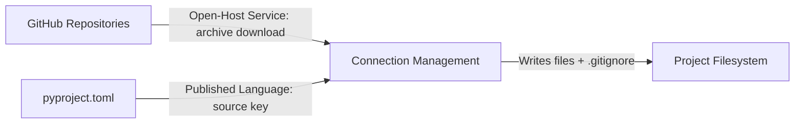

# Context Map: smith

> DDD context map showing relationships between bounded contexts.
> Updated by the Software Architect when contexts or relationships change.
> Follows the DDD strategic design patterns for inter-context relationships.

---

## Context Relationships

smith has a single bounded context (Connection Management), so there are no inter-context relationships to map. The context interacts with external systems:

| Upstream Context | Downstream Context | Relationship Pattern | Translation / Anti-Corruption Layer |
|-----------------|-------------------|---------------------|-------------------------------------|
| GitHub Repositories | Connection Management | Open-Host Service | smith accesses public archive URLs; no authentication required. The repo name is parsed from source strings via `_parse_github_url` |
| Local Filesystem (project dir) | Connection Management | Shared Kernel | smith reads/writes project files and .gitignore using the same filesystem conventions as git |
| pyproject.toml config | Connection Management | Published Language | `[tool.smith] source` key is a published contract within the project's own config file |

---

## Context Map Diagram

> The Connection Management context is the sole bounded context within smith. It owns the clone and purge operations and all supporting logic (source resolution, file fetching, .gitignore management). External systems — GitHub, local filesystem, and pyproject.toml — are dependencies, not separate bounded contexts.

---

## Integration Points

| Integration | From | To | Mechanism | Contract |
|-------------|------|----|-----------|----------|
| Archive download | GitHub | Connection Management | Sync HTTP (requests.get) | GitHub archive URL pattern: `https://github.com/{user}/{repo}/archive/refs/heads/{branch}.zip` |
| URL archive download | Remote URL | Connection Management | Sync HTTP (requests.get) | URL must point to a .zip or .tar.gz archive containing allowed-topic files |
| Local directory walk | Local Filesystem | Connection Management | Sync filesystem (os.walk) | Directory must contain files matching ALLOWED_TOPICS prefixes |
| Config reading | pyproject.toml | Connection Management | Sync file read (tomllib) | `[tool.smith] source = "..."` TOML key |
| File writing | Connection Management | Project Filesystem | Sync filesystem (pathlib write) | Files written at project root; .gitignore section delimited by markers |
| File removal | Connection Management | Project Filesystem | Sync filesystem (shutil.rmtree, Path.unlink) | Only paths listed in smith-managed .gitignore section |

---

## Anti-Corruption Layers

| ACL | Protects Context | From Context | Translation Rules |
|-----|-----------------|--------------|-------------------|
| `_is_allowed` filter | Connection Management | Template sources (GitHub, URLs, local dirs) | Strips all files not matching ALLOWED_TOPICS prefixes, ensuring only agentic config files are ever written to the project directory |
| `_detect_top_dir` + prefix stripping | Connection Management | Archive formats (zip/tar) | Removes the single top-level directory (e.g., `temple8-main/`) from archive entries so files are written at project root, not nested under the repo folder |
| `resolve_source` chain | Connection Management | User input | Normalises source from CLI arg, config, or default into a canonical string for `fetch()` |

---

## Bounded Context Details

### Connection Management Context

**Responsibility:** Manage the full lifecycle of cloning agentic files to a project directory — clone and purge.

**Aggregate Root:** Connection (orchestrated by clone/purge functions in core.py)

**Key Invariants:**
- Reliability: only files matching ALLOWED_TOPICS prefixes are written — zero disallowed files, ever
- Reversibility: purge removes only files listed in the managed .gitignore section — zero non-managed files deleted
- Safety: existing directories and files are skipped by default; `--overwrite` is required to replace

**CLI Commands (delivery mechanism):**
- `smith clone [--source <path/url>] [--overwrite]`
- `smith purge`

**Entities:** FileSpec (value object), GitignoreManager (entity), Connection (aggregate)

---

## Changes

| Date | Source | Change | Reason |
|------|--------|--------|--------|
| 2026-05-02 | initial | Context map derived from working code | Baseline from existing implementation on rebuild/minimal-v2 branch |