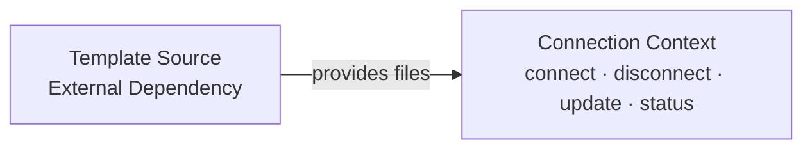

# Context Map: smith

> DDD context map showing relationships between bounded contexts.
> Updated by the Software Architect when contexts or relationships change.
> Follows the DDD strategic design patterns for inter-context relationships.

---

## Context Relationships

| Upstream Context | Downstream Context | Relationship Pattern | Translation / Anti-Corruption Layer |
|-----------------|-------------------|---------------------|-------------------------------------|
| Template Source (External) | Connection | Customer-Supplier | Connection reads files from the template source; no translation needed — files are copied as-is |

> smith has one bounded context (Connection). The Template Source is an external dependency, not a separate bounded context within smith. It provides files but has no domain logic or invariants that smith owns. The relationship is Customer-Supplier: smith (downstream) depends on the template source (upstream) for file content, but does not control it. If template versioning or validation becomes a domain concern, Template Source may be promoted to its own bounded context.

---

## Context Map Diagram

> The Connection context is the sole bounded context within smith. It owns the Connection aggregate and all four CLI commands. The Template Source is an external dependency (default: agents-smith; override: `--from <path/url>`) that provides the agentic files to be written. There is no anti-corruption layer because the files are copied as-is — no domain translation is needed.

---

## Integration Points

| Integration | From | To | Mechanism | Contract |
|-------------|------|----|-----------|----------|
| File Provisioning | Template Source | Connection | importlib.resources from package data (bundled), filesystem read (local), HTTP download (URL) | Template source must provide a valid directory structure containing AGENTS.md, .opencode/, .templates/, and .flowr/ |

> The only integration point is file provisioning: the Connection context reads agentic files from the template source. For the default (agents-smith), files are read from the `smith/data/` package directory via `importlib.resources` — no network access required. For `--from <path>`, files are read from the local filesystem. For `--from <url>`, files are downloaded via HTTP (`.tar.gz` or `.zip`) and extracted to a temporary directory. No domain events cross this boundary — it is a simple data dependency.

---

## Anti-Corruption Layers

| ACL | Protects Context | From Context | Translation Rules |
|-----|-----------------|--------------|-------------------|
| TemplateSourceAdapter | Connection | Template Source (External) | Normalises different source types (bundled package data, local path, remote URL) into a uniform file-provider interface that the Connection aggregate can consume without knowing the source type |

> The TemplateSourceAdapter protects the Connection context from variations in how template files are obtained. It translates between three source types (bundled package data via importlib.resources, local filesystem paths, remote URLs via HTTP download) and presents a uniform interface: "given a template source, provide the set of files to write." This keeps the Connection aggregate focused on its invariants (atomicity, safety, clean separation) without coupling to file resolution details.

---

## Bounded Context Details

### Connection Context

**Responsibility:** Manage the full lifecycle of connecting agentic files to a project directory — connect, disconnect, update, and status.

**Aggregate Root:** Connection

**Key Invariants:**
- Atomicity: either all agentic files are written or none are
- Safety: existing files are never overwritten without explicit `--overwrite` flag
- Clean separation: on disconnect, no agentic files remain (only .gitignore entries)
- Consistency: .gitignore section and agentic file set are always in sync

**CLI Commands (delivery mechanism):**
- `smith connect [--from <source>] [--overwrite]`
- `smith disconnect`
- `smith update`
- `smith status`

**Entities:** Connection (aggregate root)

**Value Objects:** TemplateSource, GitignoreSection, ConnectionStatus

---

## Changes

| Date | Source | Change | Reason |
|------|--------|--------|--------|
| 2026-05-01 | architecture-assessment | Complete rewrite for corrected product scope | Previous context map described the wrong product (Python project template with single Template context). smith is an AI pair programming platform with a Connection context and external Template Source dependency. |
| 2026-05-01 | IN_20260501_local-bundle-reversal | Updated integration point and ACL description: bundled template resolution is now local package data via importlib.resources, not GitHub-based download; URL sources download via requests with no persistent cache | Local bundle provides instant offline default; GitHub-based resolution introduced runtime network dependency and cache staleness |