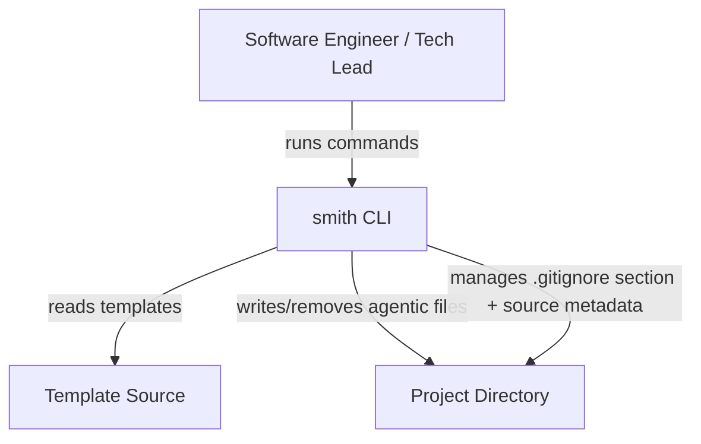
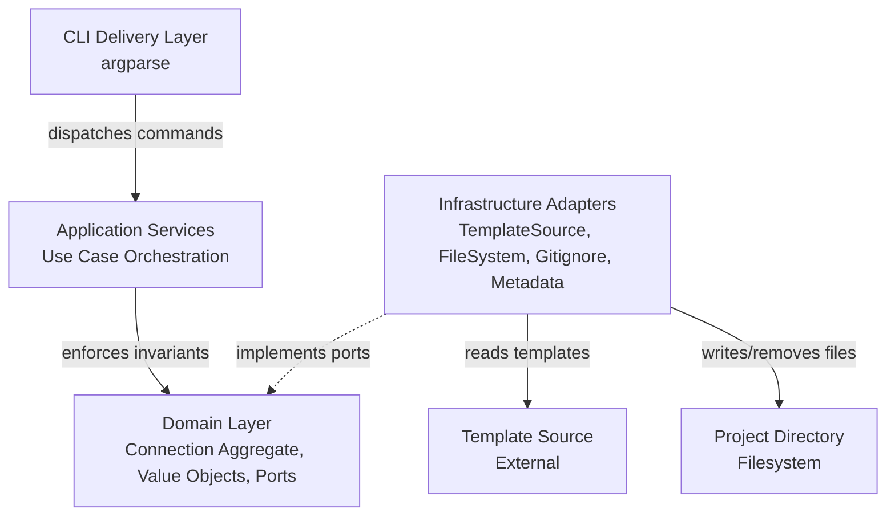
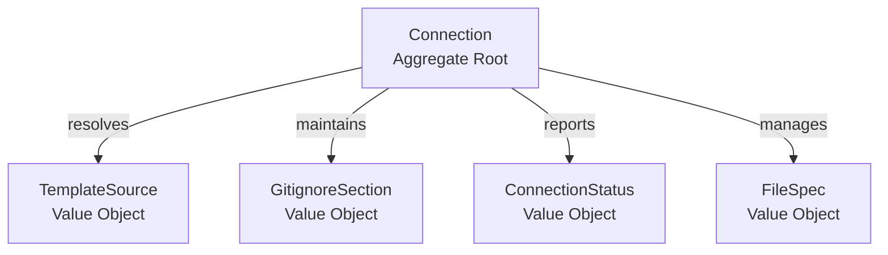
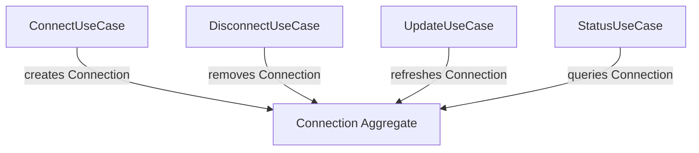
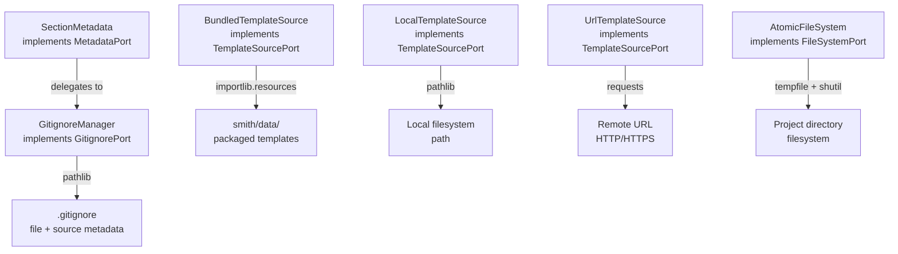

# Technical Design: smith

> Technical design document for the smith-commands feature.
> Updated by the Software Architect when stack, contracts, or interfaces change.
> Contract-first design: API and event contracts are defined here before implementation begins.

---

## Feature

`docs/features/smith-commands/` — the connect/disconnect/update/status CLI commands.

---

## Architectural Style

**Style:** Hexagonal (Ports & Adapters)

**Rationale:** smith's core domain — the Connection lifecycle — must be testable in isolation from filesystem operations, network requests, and CLI argument parsing. The quality attribute priority (Safety > Atomicity > Clean Separation > Usability) demands that domain invariants are enforced without coupling to infrastructure. Hexagonal architecture achieves this by defining ports (Protocol interfaces) in the domain layer that infrastructure adapters implement. The CLI is a delivery mechanism — a thin adapter that translates argparse results into domain commands. This allows the Connection aggregate to enforce atomicity and safety invariants without knowing whether files are written to a real filesystem or an in-memory test double. The dependency arrow always points inward: infrastructure → application → domain (Cockburn, 2005; Evans, 2003).

Note: The Safety invariant protects user-tracked files (not managed by smith) from silent overwrite. Smith-managed files (in the `# smith managed` section) may be updated by `smith connect` (auto-update) and `smith update` without `--overwrite`.

---

## Quality Attributes

| Attribute | Priority | Architectural Decision | ADR Ref |
|-----------|----------|----------------------|---------|
| Safety | 1 (Must) | Conflict detection before any write; `--overwrite` gate enforced for user-tracked files; no silent overwrites of user-tracked files ever; smith-managed files may be updated without `--overwrite` | — |
| Atomicity | 2 (Must) | Temp-directory staging with atomic rename; all files written to staging area first, then moved to final locations; on failure, staging area is discarded | ADR-002 |
| Clean Separation | 3 (Must) | Managed `.gitignore` section with clear delimiters; disconnect removes all agentic files while preserving the section as a guard; connection state inferred from the managed section in `.gitignore` (stateless — no metadata file) | — |
| Usability | 4 (Must) | Four subcommands with clear output; argparse provides help text; exit codes distinguish success/error | ADR-001 |
| Modifiability | 5 (Should) | Hexagonal architecture allows adding new template sources (URL types, git repos) without changing domain logic; new CLI flags are thin delivery-layer additions | — |
| Testability | 6 (Should) | Domain logic tested via port mocks; no filesystem or network in unit tests; integration tests use temp directories | — |

---

## Stack

| Layer | Technology | Version | Rationale |
|-------|-----------|---------|-----------|
| Language | Python | 3.13 | Project requirement (pyproject.toml: `requires-python = ">=3.13"`) |
| CLI Framework | argparse | stdlib | Sufficient for four subcommands with options; maintains minimal runtime dependencies (ADR-001) |
| Package metadata | importlib.metadata | stdlib | Already used for version/description; no new dependency |
| HTTP client | requests | PyPI | URL template source resolution (tar.gz/zip download); cleaner API and error handling than urllib.request (ADR-007) |
| Archive extraction | tarfile / zipfile | stdlib | Extract downloaded template archives for URL sources; no new dependency |
| Package resources | importlib.resources | stdlib | Read bundled template files from `smith.data` package; no new dependency |
| File operations | pathlib / shutil / tempfile | stdlib | Atomic writes, directory operations; no new dependency |
| Metadata storage | — | — | Connection state inferred from `# smith managed` section in `.gitignore`; source metadata stored in section header (e.g., `# smith managed source:agents-smith`); no separate metadata file — stateless design |

**Minimal runtime dependencies** is a deliberate constraint. The only external dependency is `requests` (used for URL template source resolution). The bundled `agents-smith` source reads from packaged files via `importlib.resources` — no network call needed. See ADR-007 for the rationale.

---

## Module Structure

```
smith/
  __init__.py              # Package marker
  __main__.py              # Entry point: python -m smith
  domain/
    __init__.py
    connection.py          # Connection aggregate root
    value_objects.py        # TemplateSource, GitignoreSection, ConnectionStatus, FileSpec
    ports.py               # TemplateSourcePort, FileSystemPort, GitignorePort, MetadataPort (Protocols)
  application/
    __init__.py
    connect.py             # ConnectUseCase
    disconnect.py          # DisconnectUseCase
    update.py              # UpdateUseCase
    status.py              # StatusUseCase
  infrastructure/
    __init__.py
    template_source.py     # BundledTemplateSource (importlib.resources), LocalTemplateSource, UrlTemplateSource
    filesystem.py          # AtomicFileSystem
    gitignore.py           # GitignoreManager
    metadata.py            # SectionMetadata
  delivery/
    __init__.py
    cli.py                 # build_parser(), main(), command handlers
```

**Dependency direction:** `delivery` → `application` → `domain` ← `infrastructure`

The domain layer has **zero** imports from application, infrastructure, or delivery. The application layer imports from domain only. Infrastructure implements domain ports. Delivery calls application use cases.

**Rationale:** This structure enforces the hexagonal boundary. The Connection aggregate enforces invariants (atomicity, safety, clean separation) without knowing whether files are written to a real filesystem or a test double. New template source types (git repos, archives) are added as infrastructure adapters without touching domain or application code.

---

## API Contracts

### `smith connect [--from <path|url>] [--overwrite]`

**Behaviour:** Write all agentic files from the template source to the current project directory. Add a managed `.gitignore` section with source metadata in the section header.

**Request:**
| Parameter | Type | Required | Default | Description |
|-----------|------|----------|---------|-------------|
| `--from` | string | No | `agents-smith` | Template source: `agents-smith` (bundled), local path, or URL |
| `--overwrite` | flag | No | False | Replace existing agentic files without prompting |

**Response (stdout):**
| Condition | Output | Exit Code |
|-----------|--------|-----------|
| Success | `Connected from <source>.` + list of files written | 0 |
| Error | `Error: <message>` | 1 |

**Preconditions:**
- Current directory is a project directory (writable)
- If already connected (`# smith managed` section exists), auto-update managed files
- User-tracked files (not in `# smith managed` section) are skipped, not reported as conflicts
- `--overwrite` replaces all managed files; user-tracked files are always preserved

**Postconditions:**
- All agentic files present in project directory (atomicity)
- `# smith managed` section added to `.gitignore` with source metadata in header
- No partial state on failure (atomicity)

---

### `smith disconnect`

**Behaviour:** Remove all smith-managed agentic files from the current project directory. Preserve the `# smith managed` section in `.gitignore` (serves as guard for future usage). Smith is stateless — no metadata file to remove.

**Request:** No parameters.

**Response (stdout):**
| Condition | Output | Exit Code |
|-----------|--------|-----------|
| Success | `Disconnected.` + list of files removed | 0 |
| Not connected | `Not connected — nothing to disconnect.` | 0 |
| Error | `Error: <message>` | 1 |

**Preconditions:**
- Current directory is a project directory (writable)

**Postconditions:**
- No smith-managed agentic files remain in project directory (clean separation)
- `# smith managed` section preserved in `.gitignore` (guard for future usage)
- If `.gitignore` is empty after removal, it is left as an empty file (not deleted)

---

### `smith update`

**Behaviour:** Refresh agentic files in a connected project directory from the original or specified template source. Overwrite all managed agentic files with latest versions. If the project is not connected, auto-connect (same as `smith connect`).

**Request:** Optional `--from <source>` to use a different template source.

**Response (stdout):**
| Condition | Output | Exit Code |
|-----------|--------|-----------|
| Success | `Updated from <source>.` + list of files updated | 0 |
| Not connected (auto-connect) | Same as `smith connect` | 0 |
| Error | `Error: <message>` | 1 |

**Preconditions:**
- Template source must be reachable

**Postconditions:**
- All agentic files updated to latest from template source
- Source metadata in `.gitignore` section header updated
- `.gitignore` managed section patterns updated if changed

---

### `smith status`

**Behaviour:** Report whether the current project directory is connected, which agentic files are present, and which template source was used.

**Request:** No parameters.

**Response (stdout):**
| Condition | Output | Exit Code |
|-----------|--------|-----------|
| Connected | `Connected from <source>.` + list of files with status | 0 |
| Disconnected | `Not connected.` | 1 |
| Partial | `Partial connection — some files missing:` + list with status | 1 |

**Preconditions:** None (always succeeds in reporting).

**Postconditions:** None (read-only, no side effects).

---

## Event Contracts

smith is a synchronous CLI tool with no event-driven communication. All operations are request-response within a single process. No event contracts are needed for the current architecture.

If smith evolves to support background operations or daemon mode, event contracts will be defined at that time (YAGNI).

---

## Interface Definitions

### TemplateSourcePort

```python
from pathlib import Path
from typing import Protocol


class TemplateSourcePort(Protocol):
    """Port for resolving template files from a source.

    Implementations: BundledTemplateSource, LocalTemplateSource, UrlTemplateSource.
    The domain defines this interface; infrastructure adapters implement it.
    """

    def resolve(self) -> list[FileSpec]:
        """Resolve the template source into a list of file specifications.

        Returns:
            List of FileSpec objects, each containing a relative path and content.

        Raises:
            TemplateSourceError: If the source cannot be resolved
                (not found, network error, invalid archive).
        """
        ...

    def gitignore_patterns(self) -> list[str]:
        """Return gitignore patterns for the managed section.

        Returns:
            List of gitignore patterns (e.g., ['.opencode/', '.templates/',
            '.flowr/sessions/']).
        """
        ...
```

### FileSystemPort

```python
class FileSystemPort(Protocol):
    """Port for atomic file system operations.

    Implementations: AtomicFileSystem (production), InMemoryFileSystem (tests).
    The domain defines this interface; infrastructure adapters implement it.
    """

    def check_conflicts(self, paths: list[Path]) -> list[Path]:
        """Check which paths already exist in the project directory.

        Args:
            paths: List of relative paths to check.

        Returns:
            List of paths that already exist in the project directory.
        """
        ...

    def write_atomic(self, specs: list[FileSpec]) -> None:
        """Write all file specifications atomically to the project directory.

        Either all files are written or none are. On failure, any partially
        written files are rolled back.

        Args:
            specs: List of FileSpec objects with relative paths and content.

        Raises:
            FileSystemError: If any write fails (rolled back to clean state).
        """
        ...

    def remove(self, paths: list[Path]) -> None:
        """Remove files and directories from the project directory.

        Args:
            paths: List of relative paths to remove.

        Raises:
            FileSystemError: If any removal fails.
        """
        ...

    def exists(self, paths: list[Path]) -> dict[Path, bool]:
        """Check which paths exist in the project directory.

        Args:
            paths: List of relative paths to check.

        Returns:
            Dictionary mapping each path to whether it exists.
        """
        ...
```

### GitignorePort

```python
class GitignorePort(Protocol):
    """Port for managing the smith-managed section in .gitignore.

    Implementations: GitignoreManager (production), InMemoryGitignore (tests).
    The domain defines this interface; infrastructure adapters implement it.

    Connection state is inferred from the managed section in .gitignore,
    not from a separate metadata file. This port is the primary state mechanism.
    """

    def add_section(self, patterns: list[str]) -> None:
        """Add a managed section to .gitignore with the given patterns.

        Creates .gitignore if it does not exist. The section is delimited by
        '# smith managed' and '# end smith managed' markers.

        Args:
            patterns: List of gitignore patterns to include.
        """
        ...

    def has_section(self) -> bool:
        """Check whether .gitignore contains a smith-managed section.

        Returns:
            True if the managed section exists, False otherwise.
        """
        ...

    def get_patterns(self) -> list[str]:
        """Return the gitignore patterns from the managed section.

        Returns:
            List of gitignore patterns currently in the managed section.
            Returns an empty list if the section does not exist.
        """
        ...
```

### MetadataPort

```python
class MetadataPort(Protocol):
    """Port for reading and writing connection metadata.

    Connection state is inferred from the '# smith managed' section in .gitignore,
    not from a separate metadata file. This port handles source metadata stored
    within the gitignore section header (e.g., '# smith managed source:agents-smith').

    Implementations: GitignoreManager (production, dual-implements GitignorePort
    and MetadataPort), InMemoryGitignore (tests).
    The domain defines this interface; infrastructure adapters implement it.
    """

    def save_source(self, source: TemplateSource) -> None:
        """Write template source metadata to the gitignore section header.

        Args:
            source: The template source used for the connection.
        """
        ...

    def load_source(self) -> TemplateSource | None:
        """Read template source metadata from the gitignore section header.

        Returns:
            The stored TemplateSource, or None if not connected.
        """
        ...
```

---

## Value Objects

### FileSpec

```python
from dataclasses import dataclass
from pathlib import Path


@dataclass(frozen=True)
class FileSpec:
    """A file to be written from a template source to a project directory.

    Attributes:
        relative_path: Path relative to the project root
            (e.g., 'AGENTS.md', '.opencode/agents/po.md').
        content: File content as bytes.
    """

    relative_path: Path
    content: bytes
```

### TemplateSource

```python
from dataclasses import dataclass
from typing import Literal


@dataclass(frozen=True)
class TemplateSource:
    """The origin of agentic files.

    Attributes:
        kind: 'bundled', 'local', or 'url'.
        location: 'agents-smith' for bundled, absolute path for local, URL for url.
    """

    kind: Literal["bundled", "local", "url"]
    location: str
```

### ConnectionStatus

```python
from dataclasses import dataclass
from enum import Enum


class ConnectionState(Enum):
    """Possible states of a project's connection."""

    CONNECTED = "connected"
    DISCONNECTED = "disconnected"
    PARTIAL = "partial"


@dataclass(frozen=True)
class ConnectionStatus:
    """The current state of a project's connection.

    Attributes:
        state: Whether connected, disconnected, or partial.
        source: The template source (None if disconnected).
        present_files: List of agentic file paths that exist.
        missing_files: List of agentic file paths that are missing.
    """

    state: ConnectionState
    source: TemplateSource | None
    present_files: list[Path]
    missing_files: list[Path]
```

### GitignoreSection

```python
from dataclasses import dataclass


@dataclass(frozen=True)
class GitignoreSection:
    """The managed section in .gitignore.

    Attributes:
        patterns: List of gitignore patterns (e.g., ['.opencode/', '.templates/']).
        start_marker: Section start delimiter (default: '# smith managed').
        end_marker: Section end delimiter (default: '# end smith managed').
    """

    patterns: list[str]
    start_marker: str = "# smith managed"
    end_marker: str = "# end smith managed"
```

---

## C4 Diagrams

### Context (C4 Level 1)



**Actors:**

| Actor | Description |
|-------|-------------|
| Software Engineer | Runs `smith connect` in any project directory to start working with standard AI agent workflows; runs `smith disconnect` when done |
| Tech Lead | Standardises AI agent configurations across the team's projects by connecting the same template to each one |

**Systems:**

| System | Kind | Description |
|--------|------|-------------|
| smith | Internal | CLI tool that connects/disconnects standardised agent configurations to project directories |
| Template Source | External | Provides agentic files: bundled (agents-smith), local path, or remote URL |
| Project Directory | External | The target project where agentic files are written/removed |

**Interactions:**

| Interaction | Behaviour | Technology |
|-------------|-----------|------------|
| Engineer → smith | Runs CLI commands (connect, disconnect, update, status) | Shell / terminal |
| smith → Template Source | Reads template files for provisioning | requests (bundled/URL), pathlib (local) |
| smith → Project Directory | Writes/removes agentic files, manages .gitignore section with source metadata in header | pathlib, shutil, tempfile |

### Container (C4 Level 2)



**Boundary: smith**

| Container | Technology | Responsibility |
|-----------|------------|----------------|
| CLI Delivery Layer | argparse (stdlib) | Parse CLI arguments, dispatch to use cases, format output |
| Application Services | Python (pure) | Orchestrate use cases: connect, disconnect, update, status |
| Domain Layer | Python (pure) | Enforce invariants (atomicity, safety, clean separation, consistency); define ports |
| Infrastructure Adapters | Python + requests | Implement domain ports: BundledTemplateSource (importlib.resources from smith/data), LocalTemplateSource, UrlTemplateSource (requests + tarfile/zipfile), AtomicFileSystem, GitignoreManager, SectionMetadata |

**Interactions:**

| Interaction | Behaviour |
|-------------|-----------|
| CLI → Application Services | Dispatches parsed CLI arguments to the appropriate use case |
| Application Services → Domain | Delegates invariant enforcement to the Connection aggregate |
| Infrastructure → Domain | Implements domain port Protocols; dependency arrow points inward |
| Infrastructure → Template Source | Reads template files: importlib.resources from package data (bundled), filesystem read (local), HTTP download (URL) |
| Infrastructure → Project Directory | Writes/removes agentic files atomically; manages .gitignore section with source metadata; stateless — no metadata file |

### Component (C4 Level 3) — Domain Layer



### Component (C4 Level 3) — Application Services



### Component (C4 Level 3) — Infrastructure Adapters



---

## Dependencies

| Dependency | What it provides | Why not replaced |
|------------|------------------|-----------------|
| `argparse` | CLI argument parsing | Stdlib; sufficient for four subcommands; minimal runtime dependency (ADR-001) |
| `importlib.metadata` | Package version and description | Stdlib; already used in `__main__.py` |
| `requests` | HTTP downloads for URL template sources | External; cleaner API and error handling than urllib.request; used for tar.gz/zip archive download from remote URLs (ADR-007) |
| `importlib.resources` | Read bundled template files from `smith/data` package | Stdlib; no network call needed for the default template source |
| `pathlib` | Path manipulation | Stdlib; modern Python path handling |
| `shutil` | File/directory operations (copy, rmtree) | Stdlib; needed for atomic writes and directory removal |
| `tempfile` | Temporary directory creation for atomic writes | Stdlib; core of the atomicity mechanism (ADR-002) |
| `tarfile` | Archive extraction for URL template sources | Stdlib; needed for .tar.gz archives |
| `zipfile` | Archive extraction for URL template sources | Stdlib; needed for .zip archives |
| `dataclasses` | Value object definitions | Stdlib; frozen dataclasses for immutable value objects |
| `typing` | Protocol definitions, type hints | Stdlib; `Protocol` for port definitions |

**One runtime dependency beyond Python stdlib:** `requests` is the only external package. This is a deliberate trade-off — `requests` provides significantly better HTTP handling than `urllib.request` for URL template source downloads. The bundled `agents-smith` source reads from packaged files via `importlib.resources` and requires no network call. See ADR-007.

---

## Configuration Keys

| Key | Type | Default | Description |
|-----|------|---------|-------------|
| `--from` | string | `agents-smith` | Template source: `agents-smith` (bundled), local path, or URL |
| `--overwrite` | flag | `False` | Replace existing agentic files without prompting |
| `smith.managed_section_start` | string | `# smith managed` | Delimiter marking the start of the managed .gitignore section |
| `smith.managed_section_end` | string | `# end smith managed` | Delimiter marking the end of the managed .gitignore section |
| `smith.default_template` | string | `agents-smith` | Default template source when `--from` is not specified |

**Note:** Configuration keys with the `smith.` prefix are internal constants, not user-facing configuration. They are defined as module-level constants in the domain layer and are not configurable via environment variables or config files (YAGNI). The only user-facing configuration is the `--from` and `--overwrite` CLI flags.

---

## Atomicity Implementation

The atomicity invariant (all files or none) is implemented using a **temp-directory staging pattern**:

1. **Stage:** Write all agentic files to a temporary directory (via `tempfile.mkdtemp`).
2. **Validate:** After all writes succeed, check that all expected files exist in the staging area.
3. **Commit:** Move staged files to their final locations in the project directory. Each file is moved atomically using `os.replace` (atomic on the same filesystem).
4. **Rollback:** If any step fails, remove the entire staging directory. If some commits have already succeeded, remove the committed files (best-effort rollback).

The `.gitignore` section (with source metadata in the header) is written **after** all agentic files are committed. This ensures that a partial connection never leaves the `.gitignore` section pointing to missing files. There is no separate metadata file — smith is stateless.

**Rollback on disconnect:** The `disconnect` command removes smith-managed agentic files, preserving user-tracked files and the `.gitignore` section. If any removal fails, the command reports the error but continues removing remaining files (best-effort cleanup). The `.gitignore` section is preserved as a guard for future connections.

---

## Safety Implementation

The safety invariant (no silent overwrites of user-tracked files) is implemented as a **pre-write conflict check**:

1. **Auto-update:** If the project is already connected (has `# smith managed` section and all managed files exist), `smith connect` auto-updates smith-managed files without requiring `--overwrite`. This is intentional — smith manages these files.
2. **Scan:** Before any write to an unconnected or partially-connected project, scan for existing files that conflict with the template.
3. **Skip:** If user-tracked files are found (files not in the `# smith managed` section), skip them — write only the files that don't conflict. The operation succeeds (exit 0) with the user-tracked files left untouched.
4. **Overwrite:** If `--overwrite` is set, overwrite all managed files (user-tracked files are still preserved via `_is_path_managed` within `_resolve_specs`).

The conflict check is performed by the `FileSystemPort.check_conflicts()` method, which is called by the `ConnectUseCase` before staging any writes. This keeps the safety check in the application layer (orchestration) while the domain invariant (no silent overwrites) is enforced by the Connection aggregate.

---

## .gitignore Management

The managed section in `.gitignore` uses clear delimiters:

```gitignore
# smith managed source:agents-smith
.opencode/
.templates/
.flowr/sessions/
# end smith managed
```

**On connect:**
- If `.gitignore` does not exist, create it with the managed section.
- If `.gitignore` exists but has no managed section, append the managed section.
- If `.gitignore` exists and has a managed section, auto-update (overwrite managed files, skip user-tracked files).

**On disconnect:**
- Remove all agentic files tracked in the managed section (AGENTS.md, .opencode/, .templates/, .flowr/).
- Preserve the `# smith managed` section in .gitignore — its presence serves as a guard for future `smith connect` or `smith update` commands.
- If an agentic file is NOT tracked in the managed section (user tracks it manually), do NOT remove it.

**On update:**
- If the gitignore patterns have changed (e.g., template source provides different patterns), replace the managed section with the new patterns.

---

## Template Source Resolution

The `TemplateSourceAdapter` is a facade within `smith/infrastructure/template_source.py` that normalises three source types into a uniform `TemplateSourcePort` interface:

| Source Type | Detection | Resolution |
|-------------|-----------|------------|
| Bundled (`agents-smith`) | Default (no `--from` flag) | `importlib.resources` reads agentic files from the `smith.data` package directory; no network call required |
| Local path | `--from` starts with `/`, `./`, `../`, or is an absolute path | `pathlib.Path` reads files from the local filesystem |
| Remote URL | `--from` starts with `http://` or `https://` | `requests` downloads the archive; `tarfile` or `zipfile` extracts to a temp directory; agentic file filter applied; temp directory cleaned up after resolution |

**Bundled template resolution (local package):** The default `agents-smith` template source is resolved by reading agentic files directly from the `smith.data` package directory via `importlib.resources`. No network call is required — the files are packaged with smith. The agentic file filter (`_is_agentic_path`) selects only the essential subdirectories: `AGENTS.md`, `.opencode/agents/`, `.opencode/knowledge/`, `.opencode/skills/`, `.opencode/tools/`, `.templates/`, `.flowr/`. This excludes non-essential content like `node_modules/`, `package.json`, and other development artifacts that may exist in the source repository. A manual script (`scripts/update-bundle.sh`) syncs `smith/data/` from the agents-smith `v8_release` branch when a new release is prepared. See ADR-007 for the rationale.

**Local path validation:** The `LocalTemplateSource` adapter validates that the path exists and contains the expected agentic file structure (at minimum, an `AGENTS.md` file). If the path is invalid, it raises `TemplateSourceError`.

**URL download and extraction:** The `UrlTemplateSource` adapter downloads the archive to a temporary directory, extracts it (`.tar.gz` or `.zip`), applies the agentic file filter (only `AGENTS.md`, `.opencode/agents/`, `.opencode/knowledge/`, `.opencode/skills/`, `.opencode/tools/`, `.templates/`, `.flowr/` are included — non-essential content like `node_modules/` is excluded), and returns `FileSpec` objects. The temp directory is cleaned up after the `TemplateSourcePort.resolve()` call completes. No persistent cache is maintained for URL sources — each `resolve()` call re-downloads the archive.

**Network failure handling:** If the URL download fails (network unreachable, HTTP error, timeout), `UrlTemplateSource.resolve()` raises `TemplateSourceError` with a clear message. The bundled source does not require network access — it reads from packaged files and always works offline.

---

## Entry Point Configuration

The `smith` CLI command is configured via `pyproject.toml` console scripts:

```toml
[project.scripts]
smith = "smith.delivery.cli:main"
```

This allows users to run `smith connect` after installing the package, while `python -m smith` continues to work for development.

---

## Changes

| Date | Source | Change | Reason |
|------|--------|--------|--------|
| 2026-05-01 | architecture-assessment | Initial technical design | New feature: smith-commands (connect, disconnect, update, status) |
| 2026-05-01 | IN_20260501_agents-smith-dependency-resolution | Replaced bundled template source (importlib.resources + smith/data/) with GitHub-based download + local cache; added requests dependency; added cache_dir and bundled_archive_url config keys | Bundled template files in smith/data/ were stale copies that would go out of sync; GitHub-based resolution ensures templates are always current |
| 2026-05-01 | IN_20260501_local-bundle-reversal | Reverted bundled template source to local package (importlib.resources + smith/data/); fully implemented UrlTemplateSource (tar.gz/zip with agentic filter); removed caching; removed cache_dir and bundled_archive_url config keys; deprecated BDD examples a1b2c3d4 and e5f6g7h8; superseded ADR-006 with ADR-007 | GitHub-based resolution introduced runtime network dependency and cache staleness issues; local bundle provides instant offline default experience; UrlTemplateSource handles URL sources independently |