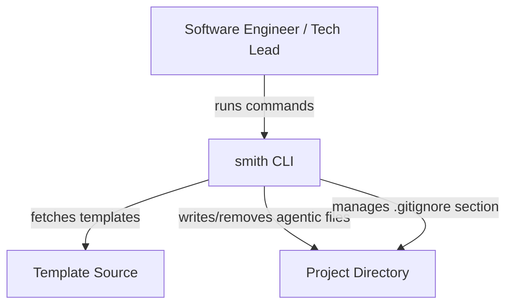
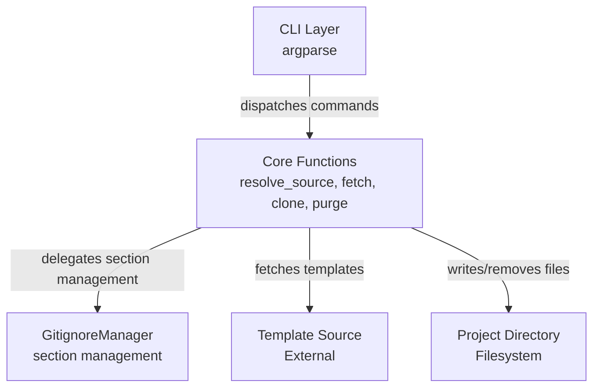

# Technical Design: smith

> Technical design document for the smith-clone-purge feature.
> Updated by the Software Architect when stack, contracts, or interfaces change.
> Contract-first design: API and event contracts are defined here before implementation begins.

---

## Feature

Core clone/purge functionality — the complete implementation as it exists today on the rebuild/minimal-v2 branch.

---

## Architectural Style

**Style:** Monolithic CLI application

**Rationale:** smith is a single-purpose tool with no persistent state, no server component, and no async requirements. With two commands (clone and purge), the complexity of a hexagonal or layered architecture is not justified. A monolithic architecture keeps the codebase simple, fast to invoke, and easy to distribute as a pip-installable package. The module boundary (cli.py, core.py, gitignore.py) is the natural seam for future extraction if complexity grows. This follows YAGNI: the current scope does not warrant ports, adapters, or a separate application layer.

---

## Quality Attributes

| Attribute | Priority | Architectural Decision | ADR Ref |
|-----------|----------|----------------------|---------|
| Reliability | 1 (Must) | `_is_allowed` filter runs on every file in archive/local source — only ALLOWED_TOPICS files are ever written | ADR-allowed-topics |
| Reversibility | 2 (Must) | purge reads the smith-managed .gitignore section and removes only listed patterns | — |
| Safety | 3 (Must) | clone skips existing directories and files by default; `--overwrite` flag required to replace | ADR-overwrite |
| Usability | 4 (Should) | Source resolution chain: CLI `--source` > pyproject.toml `tool.smith.source` > default | — |
| Modifiability | 5 (Should) | New source types are added to `fetch()` in core.py without changing clone/purge logic | — |
| Testability | 6 (Should) | Core logic (fetch, clone, purge) can be tested with mock filesystem and mock HTTP; GitignoreManager tested with temp directories | — |

---

## Stack

| Layer | Technology | Version | Rationale |
|-------|-----------|---------|-----------|
| Language | Python | 3.13+ | Modern Python with tomllib in stdlib; match statements available |
| CLI Framework | argparse | stdlib | Sufficient for two subcommands with options; maintains minimal runtime dependencies |
| Package metadata | importlib.metadata | stdlib | Used for version in CLI; no new dependency |
| HTTP Client | requests | 2.32+ | Downloads GitHub archives and URL templates; cleaner API and error handling than urllib.request |
| Archive extraction | tarfile / zipfile | stdlib | Extract downloaded template archives for URL sources; no new dependency |
| File operations | pathlib / shutil / os | stdlib | File writes, directory removal, tree walking; no new dependency |
| Configuration | tomllib | stdlib | Read `[tool.smith] source` from pyproject.toml; no new dependency |
| Testing | pytest | 9.0.3+ | Industry-standard Python testing |
| Linting | ruff | 0.11.5+ | Fast linter/formatter |
| Build | setuptools | 68.0+ | Standard Python packaging |

**Minimal runtime dependencies** is a deliberate constraint. The only external dependency is `requests`. All other functionality uses Python stdlib. This keeps the package lightweight and easy to install.

---

## Module Structure

```
smith/
  __init__.py          # Package marker
  __main__.py          # Entry point (python -m smith)
  cli.py               # CLI argument parsing and command dispatch
  core.py              # Source resolution, fetching, clone, purge, FileSpec
  gitignore.py         # GitignoreManager — .gitignore section management
```

**Dependency direction:** `cli.py` → `core.py` → `gitignore.py`. No circular imports. `gitignore.py` has no dependency on `core.py`.

**Rationale:** This flat module structure keeps the code navigable. `core.py` contains all domain logic (source resolution, fetching, allowed-topics filtering, clone/purge). `gitignore.py` encapsulates .gitignore section management. `cli.py` is a thin delivery layer. If the domain grows significantly, `core.py` can be split into modules, but the current scope (two commands) does not justify a multi-layer architecture.

---

## API Contracts

### `smith clone [--source SOURCE] [--overwrite]`

**Behaviour:** Resolve the template source (CLI arg > pyproject.toml > default), fetch files from the source, filter by allowed topics, write them to the project directory, and update the smith-managed .gitignore section.

**Request:**
| Parameter | Type | Required | Default | Description |
|-----------|------|----------|---------|-------------|
| `--source` | string | No | `github:nullhack/temple8` (or `[tool.smith] source` from pyproject.toml if present) | Template source: `github:user/repo`, local path, or URL to zip/tar.gz |
| `--overwrite` | flag | No | False | Overwrite existing files and directories |

**Response (stdout):**
| Condition | Output | Exit Code |
|-----------|--------|-----------|
| Success | (no output) | 0 |
| Error | `Error: <message>` | 1 |

**Preconditions:**
- Current directory is a project directory (writable)
- Source is reachable (for GitHub/URL sources)

**Postconditions:**
- All allowed-topic files from source are present in project directory
- `# smith managed` section in .gitignore contains top-level patterns for written files
- Existing files are skipped unless `--overwrite` is passed

**Errors:**
| Error | Message |
|-------|---------|
| Source not found | `Failed to download from GitHub: <repo>` or `Template directory not found: <path>` |
| No matching files | `No matching files found in source: <source>` or `No matching files found in zip archive` |
| Empty archive | `Zip archive is empty` or `Tar archive is empty` |

---

### `smith purge`

**Behaviour:** Read the smith-managed .gitignore section, delete every file and directory listed there, and preserve the section markers.

**Request:** No parameters.

**Response (stdout):**
| Condition | Output | Exit Code |
|-----------|--------|-----------|
| Success | `Removed: <path>` for each removed file/directory | 0 |
| Not cloned | `Nothing to purge (no smith-managed section found)` | 0 |
| Error | `Error: <message>` | 1 |

**Preconditions:**
- Current directory is a project directory (writable)

**Postconditions:**
- No smith-managed files remain in project directory (only files listed in .gitignore section are removed)
- `# smith managed` section is preserved in .gitignore (serves as guard for future clones)

---

## Event Contracts

smith is a synchronous CLI tool with no event-driven communication. All operations are request-response within a single process. No event contracts are needed for the current architecture.

Internal flow:

### SourceResolved

**Schema:**
```json
{
  "source": "github:nullhack/temple8",
  "origin": "cli_arg | pyproject_toml | default"
}
```

**Produced by:** `smith.core.resolve_source`
**Consumed by:** `smith.core.clone`

### FilesFetched

**Schema:**
```json
{
  "source": "github:nullhack/temple8",
  "file_count": 12,
  "top_level_patterns": [".opencode/", ".flowr/", "AGENTS.md"]
}
```

**Produced by:** `smith.core.fetch`
**Consumed by:** `smith.core.clone`

---

## Interface Definitions

### FileSpec

```python
from dataclasses import dataclass
from pathlib import Path


@dataclass(frozen=True)
class FileSpec:
    """A file to be written from a template source to a project directory.

    Attributes:
        relative_path: Path relative to the project root
            (e.g., 'AGENTS.md', '.opencode/agents/po.md').
        content: File content as bytes.
    """

    relative_path: Path
    content: bytes
```

### GitignoreManager

```python
from pathlib import Path


class GitignoreManager:
    """Read and mutate the smith-managed section of a project's .gitignore."""

    def __init__(self, project_dir: Path) -> None: ...

    def add_section(self, patterns: list[str]) -> None:
        """Add or replace the smith-managed section in .gitignore."""

    def has_section(self) -> bool:
        """Return whether a smith-managed section exists in .gitignore."""

    def get_patterns(self) -> list[str]:
        """Return the non-comment patterns inside the smith-managed section."""
```

### Core Functions

```python
def resolve_source(source_arg: str | None, project_dir: Path) -> str:
    """Resolve the template source from CLI arg, pyproject.toml, or default."""

def fetch(source: str) -> list[FileSpec]:
    """Fetch file specs from the given source string.
    Supports github:user/repo, http/https URLs, and local paths."""

def clone(project_dir: Path, source: str, overwrite: bool = False) -> None:
    """Clone a project to a template source.
    Fetches files, filters by allowed topics, writes to project directory,
    and updates the smith-managed .gitignore section."""

def purge(project_dir: Path) -> list[Path]:
    """Delete files/folders listed in the smith-managed .gitignore section.
    Returns list of removed paths."""
```

---

## C4 Diagrams

### Context (C4 Level 1)



**Actors:**

| Actor | Description |
|-------|-------------|
| Software Engineer | Runs `smith clone` or `smith purge` to manage agentic files in a project |
| Tech Lead | Standardises AI agent configurations across projects by cloning the same template |

**Systems:**

| System | Kind | Description |
|--------|------|-------------|
| smith | Internal | CLI tool that clones/purges standardised agent configurations |
| Template Source | External | Provides agentic files: GitHub repo, local path, or remote URL |
| Project Directory | External | The target project where agentic files are written/removed |

**Interactions:**

| Interaction | Behaviour | Technology |
|-------------|-----------|------------|
| Engineer → smith | Runs CLI commands (clone, purge) | Shell / terminal |
| smith → Template Source | Fetches template files: GitHub (HTTPS zip), URL (HTTP download), local (pathlib walk) | requests, pathlib, os |
| smith → Project Directory | Writes/removes agentic files; manages .gitignore section | pathlib, shutil |

### Container (C4 Level 2)



**Boundary: smith**

| Container | Technology | Responsibility |
|-----------|------------|----------------|
| CLI Layer | argparse (stdlib) | Parse CLI arguments, dispatch to core functions, format output |
| Core Functions | Python (pure) | Source resolution, file fetching, allowed-topics filtering, clone/purge orchestration |
| GitignoreManager | Python (pure) | Read and mutate the smith-managed section in .gitignore |

**Interactions:**

| Interaction | Behaviour |
|-------------|-----------|
| CLI → Core | Parses CLI args, calls clone/purge with resolved source |
| Core → GitignoreManager | After writing files, delegates .gitignore section management |
| Core → Template Source | Fetches template files: requests for GitHub/URL, pathlib for local |
| Core → Project Directory | Writes fetched files, skips existing unless --overwrite |

---

## Dependencies

| Dependency | What it provides | Why not replaced |
|------------|------------------|-----------------|
| `argparse` | CLI argument parsing | Stdlib; sufficient for two subcommands; minimal runtime dependency |
| `importlib.metadata` | Package version and description | Stdlib; already used in `__main__.py` |
| `requests` | HTTP downloads for GitHub archives and URL template sources | External; cleaner API and error handling than urllib.request |
| `pathlib` | Path manipulation | Stdlib; modern Python path handling |
| `shutil` | File/directory operations (rmtree for purge) | Stdlib; needed for directory removal |
| `tarfile` | Archive extraction for URL template sources (.tar.gz) | Stdlib; needed for .tar.gz archives |
| `zipfile` | Archive extraction for GitHub and URL template sources (.zip) | Stdlib; needed for .zip archives |
| `dataclasses` | FileSpec value object definition | Stdlib; frozen dataclass for immutable value object |
| `tomllib` | Reading `[tool.smith] source` from pyproject.toml | Stdlib (Python 3.11+); no new dependency |

**One runtime dependency beyond Python stdlib:** `requests`. This is a deliberate trade-off — `requests` provides significantly better HTTP handling than `urllib.request` for downloading GitHub archives and URL templates.

---

## Configuration Keys

| Key | Type | Default | Description |
|-----|------|---------|-------------|
| `--source` | string | `github:nullhack/temple8` | Template source: `github:user/repo`, local path, or URL to zip/tar.gz. Falls back to `[tool.smith] source` in pyproject.toml, then to default. |
| `--overwrite` | flag | `False` | Replace existing files and directories without prompting |
| `ALLOWED_TOPICS` | tuple[str, ...] | `("AGENTS.md", ".opencode/", ".flowr/", ".templates/")` | Path prefixes that are allowed to be written during clone (module-level constant, not user-configurable) |
| `DEFAULT_SOURCE` | str | `"github:nullhack/temple8"` | Default template source when neither `--source` nor pyproject.toml provides one (module-level constant) |
| `START_MARKER` | str | `"# smith managed"` | Delimiter marking the start of the managed .gitignore section |
| `END_MARKER` | str | `"# end smith managed"` | Delimiter marking the end of the managed .gitignore section |

**Note:** Configuration keys with module-level constant names are internal, not user-facing. The only user-facing configuration is the `--source` and `--overwrite` CLI flags, and the `[tool.smith] source` key in pyproject.toml.

---

## Source Resolution

The `fetch()` function in `core.py` normalises three source types into a uniform `list[FileSpec]` interface:

| Source Type | Detection | Resolution |
|-------------|-----------|------------|
| GitHub repo | `github:` prefix | Downloads zip archive from `https://github.com/{user}/{repo}/archive/refs/heads/main.zip`; falls back to `master.zip` on 404; extracts and filters by allowed topics |
| HTTP/HTTPS URL | `http://` or `https://` prefix | Downloads archive; if URL contains `github.com`, uses GitHub resolution; otherwise extracts as zip or tar.gz based on extension |
| Local path | Any other string | Walks directory tree with `os.walk`; filters files by allowed topics |

**Archive prefix stripping:** When a zip or tar archive contains a single top-level directory (e.g., `temple8-main/`), `_detect_top_dir` strips it so files are written at project root, not nested under the repo folder. This ensures consistent file paths regardless of how the archive is structured.

**Allowed-topics filter:** The `_is_allowed` function checks each file's relative path against the `ALLOWED_TOPICS` tuple. Only files matching one of the prefixes (`AGENTS.md`, `.opencode/`, `.flowr/`, `.templates/`) are included in the result. This is the primary safety boundary — no file outside these prefixes can reach the project directory.

**Network failure handling:** If the GitHub or URL download fails (network unreachable, HTTP error, timeout), `fetch()` raises `RuntimeError` with a clear message. The CLI catches this and writes the error to stderr with exit code 1.

---

## Entry Point Configuration

The `smith` CLI command is configured via `pyproject.toml` console scripts:

```toml
[project.scripts]
smith = "smith.__main__:main"
```

This allows users to run `smith clone` after installing the package, while `python -m smith` continues to work for development.

---

## Changes

| Date | Source | Change | Reason |
|------|--------|--------|--------|
| 2026-05-02 | initial | Technical design derived from working code | Baseline from existing implementation on rebuild/minimal-v2 branch |